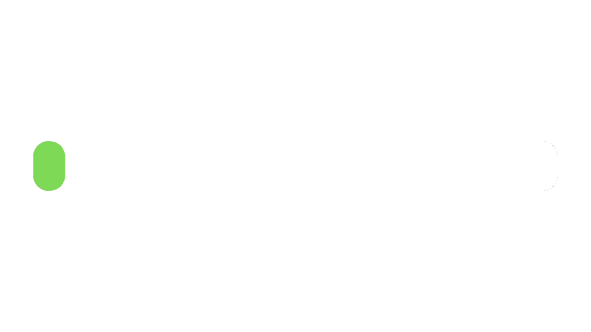

# GGFeatures_REL

<!-- PROJECT LOGO -->
 

  

  

  <h1 align="center">GGFeatures Reloaded</h1>

  

    Over 47 re-coded Features of the GrieferGames Network!
     
    <s><a href=" "><strong>Erkunde unser Wiki »</strong></a></s>
     
     
    <s><a href=" ">Patreon werden</a></s>
    ·
    <a href="https://github.com/CalledCracki/GGFeaturesREL/issues">Bugs melden</a>
    ·
    <a href="https://discord.gg/asHhkfA4HA">Unser Discord Server</a>
  

<!-- TABLE OF CONTENTS -->

  
Übersicht

  <ol>
    <li>
      <a href="#über-das-projekt">Über das Projekt</a>
    </li>
    <li>
      <a href="#erste-schritte">Erste Schritte</a>
      <ul>
        <li><a href="#installation">Installation</a></li>
      </ul>
    </li>
    <li><a href="#to-do-liste">TO-DO Liste</a></li>
    <li><a href="#mitwirken">Mitwirken</a></li>
    <li><a href="#lizenz">Lizenz</a></li>
    <li><a href="#kontakt">Kontakt</a></li>
  </ol>

<!-- ABOUT THE PROJECT -->
### Über das Projekt

Ursprünglich von Niklas409 gestartet, beinhaltet dieses langjährige Projekt die wichtigsten und bekanntesten Features eines der größten deutschen Minecraft Netzwerke. Nach 4 Jahren ohne jegliche Verbesserungen oder Updates gibt es nun endlich die GGFeatures Version 4.0!

Einige der wichtigsten Änderungen:
* Das neue System wird für alle Versionen ab der Version 1.8 verfügbar sein!
* Die neusten GGFeatures Versionen laufen effizienter. 
* (Mehr oder weniger) regelmäßige Updates der neuen GGFeatures Versionen :)
* Aktiver Support bei Fehlern oder Wünschen

_Weitere Informationen findest du hier:_ **LINK KOMMT NOCH**

(<a href="#top">Back to top</a>)

<!-- GETTING STARTED -->
### Erste Schritte

Hier erfährst du die wichtigsten Schritte, wie du das GGFeaturesREL-System auf deinem Server nutzen kannst.

## Voraussetzungen

Wenn du kein eigenes System verwenden möchtest, empfiehlt es sich, eines der unten aufgeführten Plugins zu installieren.

<h2>Permission System</h2>
<h3>PermissionsEx</h3>
Spigot Resource: https://www.spigotmc.org/resources/permissionsex.108323/

GitHub Repository: https://github.com/PEXPlugins/PermissionsEx

<h3>LuckPerms</h3>
Spigot Resource: https://www.spigotmc.org/resources/luckperms.28140/

GitHub Repository: https://github.com/LuckPerms/LuckPerms

<h2>Money System</h2>
<h3>EssentialsX</h3>
Spigot Ressource: https://www.spigotmc.org/resources/essentialsx.9089/

Github Repository: https://github.com/EssentialsX/Essentials

### Installation

_Hier erfahren Sie kurz und bündig, wie Sie GGFeatures richtig installieren und einrichten._

1. Lade das Plugin auf in den releases herunter.
2. Lade die heruntergeladene .jar-Datei in den Plugins-Ordner deines Servers.
3. Lade deinen Server mit /reload neu.
4. Prüfe, ob ein Fehler in der Konsole auftritt.
5. Mit dem Befehl /gg kannst du überprüfen, ob die Installation erfolgreich war.
6. In deinem Plugins-Ordner sollte nun der Ordner "GGFeaturesREL" angelegt worden sein.

_In diesem Ordner befinden sich noch weitere neue Dateien und Ordner._
_Die Datei mit dem Namen "config.yml" ist das Zentrum des GGFeatures Systems 
und verwaltet die wichtigsten Einstellungen._
_Dort kannst du alles so anpassen, wie es für dich am bequemsten ist._

(<a href="#top">Back to top</a>)

<!-- ROADMAP -->
### TO-DO Liste

- [x] Changelogs hinzufügen
- [x] Zurück-zum-Start-Links hinzufügen
- [ ] Zusätzliche Screenshots und Beispiele hinzufügen
- [ ] Eine Wiki-Seite erstellen und hinzufügen.

Eine vollständige Liste der vorgeschlagenen Funktionen (und bekannten Probleme) findest du unter [open issues](https://github.com/CalledCracki/GGFeaturesREL/issues).

(<a href="#top">Back to top</a>)

<!-- CONTRIBUTING -->
### Mitwirken

Wir legen sehr viel Wert auf Zusammenarbeit.
Wenn du das Gefühl haben solltest, dass du dieses Projekt unterstützen möchtest,
clone dieses Repo und erstelle dann einen Pull Request.

`$ git clone https://github.com/CalledCracki/GGFeaturesREL.git`

Wir werden uns den Pull Request ansehen und ihn dann ggf. bestätigen.

(<a href="#top">Back to top</a>)

<!-- LICENSE -->
### Lizenz

Veröffentlicht unter der MIT-Lizenz. Siehe `LICENSE.txt` für weitere Informationen.

(<a href="#top">Back to top</a>)

<!-- CONTACT -->
### Kontakt

## Discord Server
Discord Server - [Nikunity](https://discord.gg/asHhkfA4HA)

## Patreon

## Projekt Link

(<a href="#top">Back to top</a>)

<!-- MARKDOWN LINKS & IMAGES -->
[product-screenshot]: images/screenshot.png
